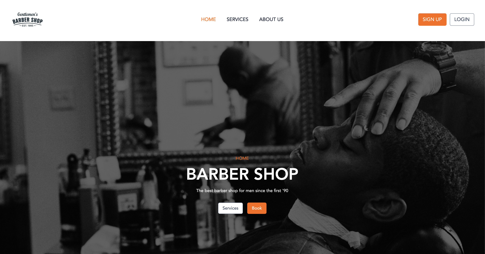

# 💈 Barber Shop Management System

A full-featured web application built with **Laravel** for managing a local barber shop.  
This project allows clients to book appointments, view available services, and manage their bookings, while admins can manage users, appointments, and pricing.
<br>

---

## ✨ Features

- 🧾 User registration and authentication
- 🧍 Role-based access (Admin / Barber / Client)
- 💇 Appointment scheduling system
- 🕒 Real-time availability management
- 💰 Dynamic service pricing and durations
- 📅 Calendar view for appointments
- 📱 Responsive and modern UI (Tailwind CSS)
- 🔐 CSRF protection and validation

---

## 🛠️ Tech Stack

- **Backend:** Laravel 11 (PHP 8+)
- **Frontend:** Blade + Tailwind CSS + Alpine.js
- **Database:** MySQL or PostgreSQL
- **Authentication:** Laravel Breeze / Jetstream
- **Version Control:** Git & GitHub

---

## ⚙️ Installation

```bash
# Clone the repository
git clone https://github.com/yourusername/barber-shop.git

# Navigate into the project directory
cd barber-shop

# Install dependencies
composer install
npm install
npm run dev
```

---

## 🧩 Environment Setup

1. Copy `.env.example` to `.env`  
   ```bash
   cp .env.example .env
   ```
2. Generate the application key  
   ```bash
   php artisan key:generate
   ```
3. Configure your **database** connection in `.env` (MySQL or PostgreSQL).

---

## 🗄️ Migrate and Seed the Database

```bash
php artisan migrate --seed
```

This will create all required tables and seed initial roles (`Admin`, `Barber`, `User`) and default services.

---

## 🔑 Authentication & Roles

- **Admin:** Manage users, appointments, and services.
- **Barber:** View assigned appointments.
- **Client:** Book and manage their own appointments.

Use Laravel’s built-in authentication system with Spatie’s Permission package for role handling.

---

## 🚀 Run the Application

```bash
php artisan serve
```

Then visit **http://localhost:8000** in your browser.

---

## 🤝 Contributing

1. Fork the repo  
2. Create a new branch (`feature/new-feature`)  
3. Commit your changes  
4. Push and open a Pull Request  

---

## 📄 License

This project is open-sourced software licensed under the [MIT license](https://opensource.org/licenses/MIT).

---

### 🧔 Made with ❤️ for developers learning Laravel
